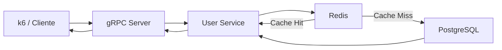
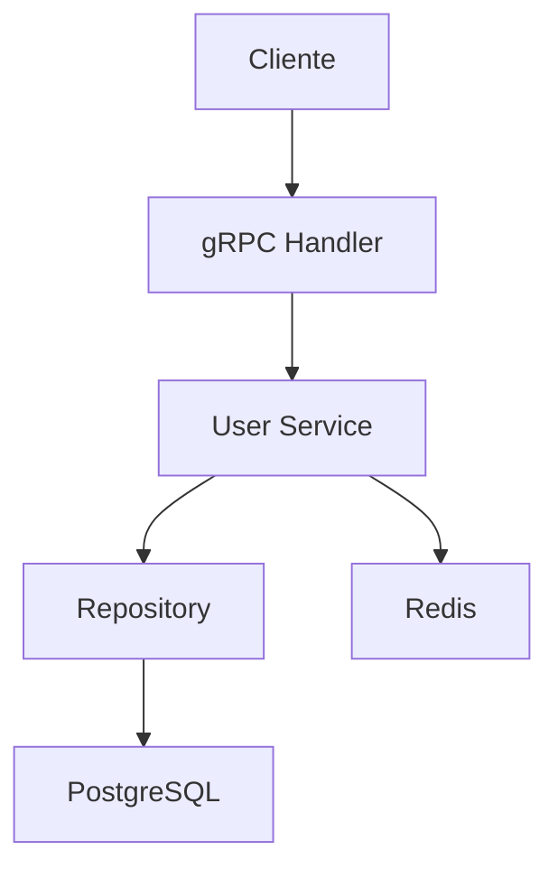
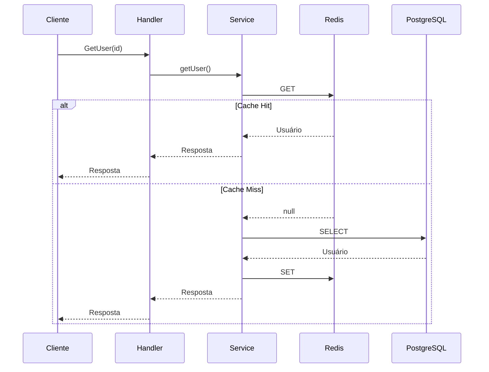
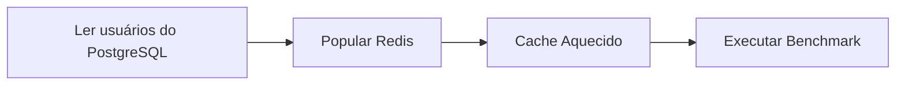
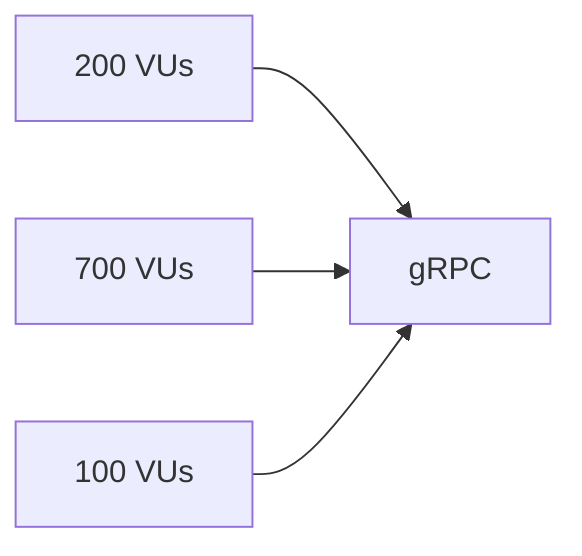
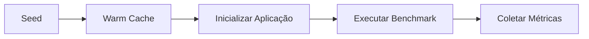
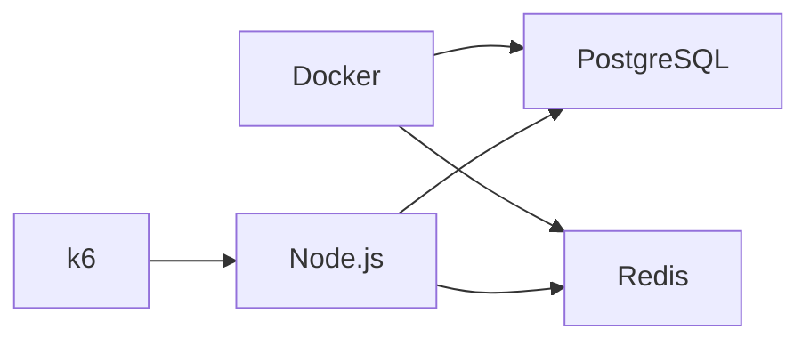

# gRPC Playground

> Benchmark comparando o impacto da estratégia **Cache Aside** em uma aplicação **gRPC**, utilizando **PostgreSQL** como banco de dados principal e **Redis** como camada de cache.

---

# Sumário

- Highlights
- Metodologia
- Objetivos
- Stack
- Arquitetura
- Estrutura do Projeto
- Arquitetura da Aplicação
- Fluxo de Consulta
- Modos de Execução
- Execução do Benchmark
- Seed
- Warm Cache
- Cenário de Benchmark
- Resultados
- Streaming
- Scripts
- Fluxo Completo
- Ambiente
- Hardware Utilizado
- Limitações
- Filosofia

---

# Highlights

- Benchmark reproduzível utilizando **k6**
- Dataset com aproximadamente **100.000 usuários**
- Comparação entre **PostgreSQL** e **PostgreSQL + Redis**
- **3,1× maior throughput**
- **67% menor latência média**
- Mesma aplicação, mesma carga e mesma infraestrutura, alterando apenas a presença da camada de cache

O objetivo deste projeto é medir, de forma reproduzível, o impacto da utilização do Redis sobre throughput, latência e carga exercida no PostgreSQL, mantendo exatamente a mesma aplicação e alterando apenas a estratégia de persistência.

---

# Metodologia

Todos os benchmarks seguem exatamente a mesma metodologia de execução.

A única variável alterada entre os cenários é a presença da camada Redis através da variável:

```env
CACHE_ACTIVE=true
CACHE_ACTIVE=false
```

Todo o restante permanece inalterado.

| Componente           | Mantido |
| -------------------- | :-----: |
| Aplicação            |   ✅    |
| Banco de dados       |   ✅    |
| Dataset              |   ✅    |
| Cenário do benchmark |   ✅    |
| Virtual Users (VUs)  |   ✅    |
| Ambiente de execução |   ✅    |
| Camada Redis         |   ❌    |

Dessa forma, throughput, latência e utilização do PostgreSQL podem ser comparados diretamente, permitindo isolar o impacto da estratégia **Cache Aside**.

---

# Objetivos

- Comparar o desempenho entre **PostgreSQL** e **PostgreSQL + Redis**.
- Demonstrar a implementação do padrão **Cache Aside**.
- Disponibilizar um benchmark reproduzível.
- Servir como referência para aplicações **gRPC** desenvolvidas em **Node.js**.

---

# Stack

- Node.js
- TypeScript
- gRPC
- PostgreSQL
- Redis
- Docker
- k6

O projeto utiliza **gRPC** para reduzir o overhead do protocolo de comunicação, permitindo concentrar a análise na camada de persistência e no impacto da estratégia de cache.

---

# Arquitetura



O fluxo demonstra a comunicação entre cliente, aplicação, Redis e PostgreSQL durante a execução do benchmark.

---

# Estrutura do Projeto

```text
src
│
├── app
│   └── bootstrap.ts
│
├── cache
│   ├── redis.ts
│   ├── redis-user.cache.ts
│   └── user.cache.ts
│
├── commands
│   ├── seed-users.ts
│   ├── warm-cache.ts
│   └── clean-users.ts
│
├── config
├── database
├── grpc
├── infrastructure
├── proto
├── repositories
├── services
└── types
```

| Diretório    | Responsabilidade                           |
| ------------ | ------------------------------------------ |
| app          | Inicialização da aplicação                 |
| cache        | Implementação da camada Redis              |
| commands     | Scripts auxiliares                         |
| database     | Configuração do PostgreSQL                 |
| grpc         | Servidor, handlers e carregamento do Proto |
| repositories | Persistência                               |
| services     | Regras de negócio                          |
| proto        | Contratos gRPC                             |
| types        | Tipagens compartilhadas                    |

A organização segue uma separação por responsabilidade, facilitando manutenção e evolução do projeto.

---

# Arquitetura da Aplicação

A aplicação está organizada em camadas independentes.



Cada camada possui uma única responsabilidade, reduzindo acoplamento e facilitando testes e manutenção.

# Fluxo de Consulta

Quando o cache está habilitado, a aplicação utiliza o padrão **Cache Aside** para consultas de leitura.



Nesse modelo, o PostgreSQL é consultado apenas quando o registro não está presente no Redis. Após a consulta, o cache é atualizado para atender requisições futuras.

---

# Modos de Execução

O projeto suporta dois cenários de execução.

## PostgreSQL (DB Only)

```text
Cliente
   │
   ▼
gRPC
   │
   ▼
PostgreSQL
   │
   ▼
Resposta
```

---

## PostgreSQL + Redis (Cache Aside)

```text
Cliente
   │
   ▼
gRPC
   │
   ▼
Redis
   │
   ▼
Cache Hit?
 ├── Sim ─────────► Resposta
 │
 └── Não
      │
      ▼
 PostgreSQL
      │
      ▼
 Atualiza Cache
      │
      ▼
   Resposta
```

A alternância entre os cenários é realizada através da variável:

```env
CACHE_ACTIVE=true
```

ou

```env
CACHE_ACTIVE=false
```

> [!IMPORTANT]
> Após alterar `CACHE_ACTIVE`, reinicie a aplicação.
>
> As variáveis de ambiente são carregadas apenas durante a inicialização do processo Node.js. Alterar o arquivo `.env` sem reiniciar a aplicação fará com que o cenário anterior continue em execução, comprometendo os resultados do benchmark.

---

# Execução do Benchmark

Todos os testes seguem exatamente a mesma sequência.

```text
Seed
   │
   ▼
Definir CACHE_ACTIVE
   │
   ▼
Inicializar aplicação
   │
   ▼
Warm Cache (quando aplicável)
   │
   ▼
Executar benchmark
   │
   ▼
Coletar métricas
   │
   ▼
Alterar CACHE_ACTIVE
   │
   ▼
Reiniciar aplicação
   │
   ▼
Executar novo benchmark
```

Essa sequência garante que ambos os cenários sejam executados sob as mesmas condições.

---

# Seed

Antes do benchmark é criada uma base contendo aproximadamente **100.000 usuários**.

Durante esse processo:

- os usuários são inseridos no PostgreSQL;
- seus UUIDs são exportados para o arquivo:

```text
k6/
└── seed-data/
    └── user-ids.json
```

O benchmark utiliza esses identificadores para garantir que todas as consultas sejam válidas.

---

# Warm Cache

O comando **Warm Cache** popula previamente o Redis com todos os registros existentes no PostgreSQL.



Essa etapa reduz a influência dos **Cache Miss** iniciais, produzindo resultados mais próximos de um ambiente de produção.

---

# Cenário de Benchmark

O benchmark utiliza uma carga mista composta por operações simultâneas.

| Operação   | VUs | Objetivo                  |
| ---------- | --: | ------------------------- |
| CreateUser | 200 | Escrita contínua          |
| GetUser    | 700 | Leitura individual        |
| ListUsers  | 100 | Server Streaming paginado |

A distribuição foi definida para representar aplicações com predominância de leitura, mantendo operações de escrita concorrentes.



A carga utilizada não tem como objetivo determinar o limite máximo da aplicação. Ela foi escolhida para permitir uma comparação consistente entre os dois cenários utilizando exatamente a mesma infraestrutura.

# Resultados

Todos os benchmarks foram executados utilizando exatamente o mesmo cenário de carga, alterando apenas a presença da camada de cache Redis.

## PostgreSQL + Redis (Warm Cache)


O Redis foi previamente aquecido utilizando o comando `warm-cache`, simulando um ambiente onde os registros mais acessados já se encontram na camada de cache.

---

## PostgreSQL (DB Only)


Neste cenário todas as leituras são realizadas diretamente no PostgreSQL, permitindo medir o impacto da ausência da camada de cache.

---

## Comparação

|          Métrica | PostgreSQL | PostgreSQL + Redis |
| ---------------: | ---------: | -----------------: |
|        Iterações |    276.787 |            861.083 |
|       Throughput |  768 req/s |    **2.392 req/s** |
|   Latência média |     1,02 s |         **330 ms** |
| Latência mediana |     1,05 s |         **212 ms** |
|              p95 |     1,24 s |         **803 ms** |

## Análise

Mantendo exatamente a mesma aplicação, infraestrutura e carga de trabalho, a introdução da camada Redis proporcionou:

- aumento aproximado de **3,1×** no throughput;
- redução de aproximadamente **67%** na latência média;
- redução significativa das consultas direcionadas ao PostgreSQL;
- menor tempo de resposta para operações de leitura.

Como apenas a estratégia de persistência foi alterada entre os cenários, os ganhos observados podem ser atribuídos diretamente à utilização do padrão **Cache Aside**.

---

# Streaming

O projeto utiliza **Server Streaming** apenas de forma paginada.

Não são realizados testes transmitindo toda a base de dados em uma única requisição.

Essa decisão aproxima o benchmark de aplicações reais, que normalmente utilizam:

- paginação;
- limites de resposta;
- controle de memória;
- redução do tráfego de rede.

---

# Scripts

## Seed

```bash
npm run seed
```

Cria aproximadamente **100.000 usuários** no PostgreSQL.

---

## Warm Cache

```bash
npm run warm-cache
```

Popula previamente o Redis utilizando todos os registros existentes.

---

## Clean

```bash
npm run clean
```

Remove todos os registros do PostgreSQL e limpa completamente o Redis.

---

## Benchmark

```bash
k6 run k6/mixed-test.js
```

Executa o cenário de benchmark definido na pasta `k6`.

---

# Fluxo Completo



---

# Ambiente

A infraestrutura utilizada durante os benchmarks é composta pelos seguintes componentes.



---

# Hardware Utilizado

Todos os testes foram executados em um computador de uso pessoal, sem hardware dedicado para servidores.

| Componente          | Especificação      |
| ------------------- | ------------------ |
| Processador         | Intel Core i5-8400 |
| Núcleos             | 6                  |
| Threads             | 6                  |
| Memória RAM         | 16 GB DDR4         |
| Armazenamento       | SSD SATA           |
| Sistema Operacional | Windows 11 64 bits |
| PostgreSQL          | Docker             |
| Redis               | Docker             |
| Aplicação           | Node.js            |
| Ferramenta de carga | k6                 |

Os resultados apresentados refletem exclusivamente este ambiente de execução.

---

# Limitações

Este benchmark possui algumas limitações conhecidas.

- Execução em máquina única.
- Ambiente local.
- Redis em modo standalone.
- PostgreSQL em instância única.
- Ausência de balanceamento de carga.
- Ausência de replicação.
- Não representa um ambiente distribuído de produção.

O objetivo deste projeto é comparar duas arquiteturas sob exatamente as mesmas condições de execução, e não determinar o limite máximo de throughput da aplicação.

---

# Filosofia do Projeto

Este projeto foi desenvolvido para avaliar o impacto da estratégia **Cache Aside** em aplicações orientadas à leitura utilizando gRPC.

Todas as medições são realizadas sobre a mesma implementação, alterando apenas a presença da camada Redis. Dessa forma, o benchmark permite isolar seu impacto sobre throughput, latência e carga exercida no PostgreSQL.

O cenário utilizado não é um **stress test**. A carga foi definida previamente para representar um ambiente de leitura predominante, permitindo comparar os dois cenários de forma consistente e reproduzível.

Mais do que obter o maior número possível de requisições por segundo, o objetivo é compreender como uma camada de cache influencia o comportamento da aplicação quando submetida às mesmas condições de execução.
