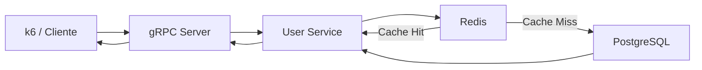
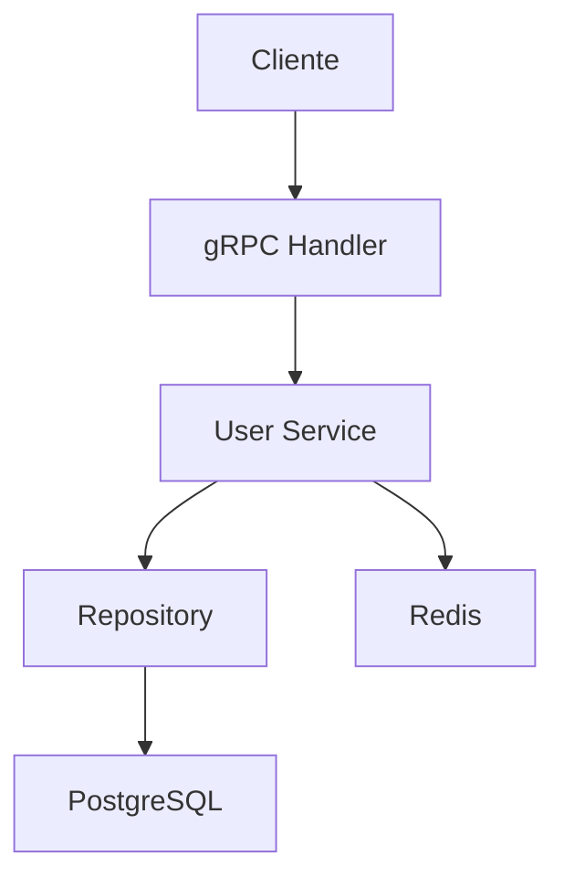
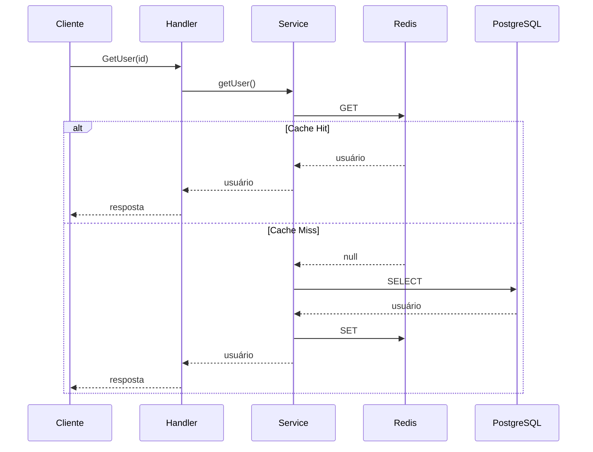
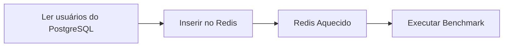
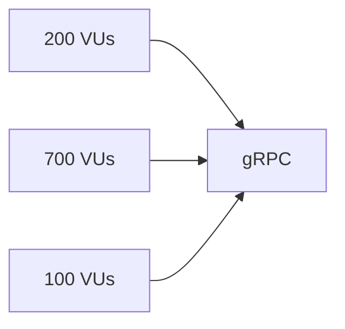
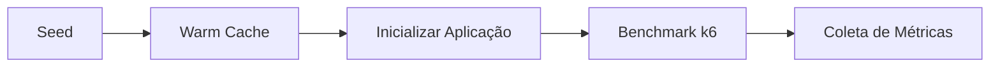
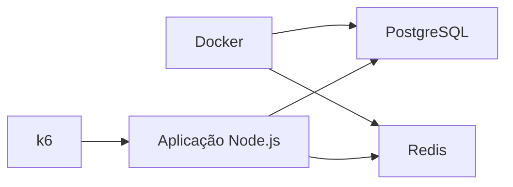

# gRPC Playground

> Benchmark para avaliação do impacto de uma camada de cache Redis sobre uma aplicação gRPC utilizando PostgreSQL como banco de dados principal.

O **gRPC Playground** é um projeto desenvolvido com foco em estudos de desempenho de aplicações backend. Seu objetivo é comparar dois cenários de execução utilizando exatamente a mesma aplicação:

* **PostgreSQL (DB Only)**
* **PostgreSQL + Redis (Cache Aside)**

A proposta é demonstrar, através de testes reproduzíveis executados com **k6**, como a introdução de uma camada de cache altera métricas como throughput, latência e carga exercida sobre o banco de dados.

O projeto utiliza **gRPC** como protocolo de comunicação para reduzir o overhead do transporte e concentrar a análise no comportamento da camada de persistência.

---

# Objetivos

* Comparar o desempenho entre **DB Only** e **DB + Redis**.
* Demonstrar o padrão **Cache Aside** em aplicações backend.
* Fornecer um ambiente reproduzível para experimentos de carga.
* Servir como referência de arquitetura para aplicações gRPC em Node.js.

---

# Stack

* Node.js
* TypeScript
* gRPC
* PostgreSQL
* Redis
* Docker
* k6

---

# Arquitetura



---

# Estrutura do Projeto

```text
src
│
├── app
│   └── bootstrap.ts
│
├── cache
│   ├── redis.ts
│   ├── redis-user.cache.ts
│   └── user.cache.ts
│
├── commands
│   ├── seed-users.ts
│   ├── warm-cache.ts
│   └── clean-users.ts
│
├── config
│
├── database
│
├── grpc
│
├── infrastructure
│
├── proto
│
├── repositories
│
├── services
│
└── types
```

Cada diretório possui uma responsabilidade bem definida:

| Diretório    | Responsabilidade                           |
| ------------ | ------------------------------------------ |
| app          | Inicialização da aplicação                 |
| cache        | Implementação da camada Redis              |
| commands     | Scripts auxiliares                         |
| database     | Conexão com PostgreSQL                     |
| grpc         | Servidor, handlers e carregamento do Proto |
| repositories | Acesso ao banco de dados                   |
| services     | Regras de negócio                          |
| proto        | Definições gRPC                            |
| types        | Tipagens compartilhadas                    |

---

# Arquitetura da Aplicação

A aplicação segue uma separação em camadas.



Cada camada possui apenas uma responsabilidade:

* **Handler** recebe requisições gRPC.
* **Service** implementa a regra de negócio.
* **Repository** acessa o PostgreSQL.
* **Cache** gerencia leituras e gravações no Redis.

---

# Fluxo de Consulta

Quando o cache está habilitado, a aplicação utiliza o padrão **Cache Aside**.



Caso o cache esteja desabilitado, toda consulta é realizada diretamente no PostgreSQL.

---

# Modos de Execução

O projeto suporta dois modos de operação.

## PostgreSQL

```text
Cliente

↓

gRPC

↓

PostgreSQL

↓

Resposta
```

---

## PostgreSQL + Redis

```text
Cliente

↓

gRPC

↓

Redis

↓

Cache Hit?

↓

Sim → Resposta

↓

Não

↓

PostgreSQL

↓

Atualiza Cache

↓

Resposta
```

A alternância entre os dois cenários é realizada através da variável:

```env
CACHE_ACTIVE=true
```

ou

```env
CACHE_ACTIVE=false
```

---

# Seed

Antes da execução dos testes é criada uma base contendo aproximadamente **100.000 usuários**.

Durante esse processo:

* usuários são inseridos no PostgreSQL;
* todos os UUIDs são armazenados;
* o k6 utiliza esses UUIDs para realizar consultas válidas.

```
k6
└── seed-data
    └── user-ids.json
```

---

# Warm Cache

Após a criação da base é possível executar o processo de **Warm Cache**.

Seu objetivo é popular previamente o Redis com todos os registros existentes, simulando um ambiente já em produção.



Sem essa etapa, os primeiros minutos do benchmark seriam dominados por **Cache Miss**, produzindo resultados pouco representativos.

---

# Cenário de Benchmark

O benchmark utiliza uma carga mista composta por operações simultâneas.

| Operação   | VUs | Objetivo           |
| ---------- | --: | ------------------ |
| CreateUser | 200 | Escrita contínua   |
| GetUser    | 700 | Leitura individual |
| ListUsers  | 100 | Streaming paginado |

A distribuição foi escolhida para representar aplicações predominantemente orientadas à leitura, mantendo operações de escrita concorrentes.



---

# Streaming

O projeto utiliza **Server Streaming** apenas de forma paginada.

Não são realizados testes transmitindo toda a base de dados em uma única requisição.

Essa decisão foi tomada porque aplicações reais normalmente utilizam:

* paginação;
* limites de resposta;
* controle de memória;
* redução do tráfego de rede.

O objetivo do benchmark é representar cenários próximos de ambientes de produção.

---

# Scripts

## Seed

Insere aproximadamente 100 mil usuários.

```bash
npm run seed
```

---

## Warm Cache

Carrega todos os registros existentes no Redis.

```bash
npm run warm-cache
```

---

## Clean

Remove todos os usuários do PostgreSQL e limpa completamente o Redis.

```bash
npm run clean
```

---

## Benchmark

```bash
k6 run k6/mixed-test.js
```

---

# Fluxo Completo



---

# Ambiente



---

# Filosofia do Projeto

Este projeto não busca produzir o maior número possível de requisições por segundo a qualquer custo. Seu objetivo é fornecer uma comparação justa entre duas arquiteturas amplamente utilizadas em aplicações backend.

Todas as medições são realizadas sobre a mesma implementação, alterando apenas a presença da camada de cache. Dessa forma, é possível observar de maneira objetiva o impacto do Redis na redução da carga sobre o banco de dados e na melhoria da latência percebida pelos clientes.

O benchmark foi estruturado para reproduzir padrões encontrados em sistemas reais, priorizando consultas individuais, operações de escrita concorrentes e streaming paginado, evitando cenários artificiais que dificilmente seriam adotados em ambientes de produção.
